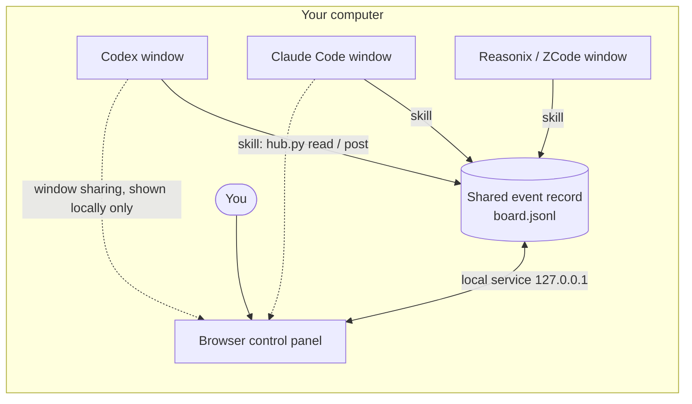

<div align="center">


# Agents Talk

**A local control panel where Codex, Claude Code and other AI clients split up work and review each other on your own computer**

[](https://github.com/fffssss11/agentstalk/actions/workflows/ci.yml)
[](https://github.com/fffssss11/agentstalk/releases/latest)
[](LICENSE)


[中文](README.md) · [User guide](docs/user-guide.md) · [First session](docs/first-session.md) · [Protocol](PROTOCOL.md) · [Changelog](CHANGELOG.md) · [Issues](https://github.com/fffssss11/agentstalk/issues)

</div>


<sub>Screenshots use isolated demo data and simulated window pictures stamped 「演示画面」 ("demo picture"); no real conversation or model call is shown. The interface and the detailed documents linked here are currently in Chinese.</sub>

Current version: `0.3.0`, under the [MIT License](LICENSE). See the [release notes](docs/release.md) for what was actually verified and the known limitations.

## Why

When several AI coding clients work at once, each stays in its own window: nobody sees the others' progress, tasks are copied around by hand, and it is up to you to remember who finished, who is waiting and whether anyone independently checked the work.

Agents Talk puts them on one local board. Every agent still runs for real in its own client and reads and writes one shared record through the collaboration skill. On one page you see every member's window, the task flow and every message, and you can add requirements, pause or end the session at any time.

## Features

| Feature | What it does |
| --- | --- |
| **Live stage** | Watch each member's window like a video meeting in gallery, focus or single view, with task, reading and work status on top; a floating monitor stays above other apps; a snapshot becomes an attachment only after you preview and confirm it |
| **Projects and sessions** | A chat-style sidebar with projects and standalone sessions; pin, rename, move, archive and search; a project presets the lead and members of its new sessions |
| **Every event visible** | The feed lists every message and task change as a one-line summary, expandable per event or globally; 「需要处理」 (needs attention) collects blocked, pending-review and unacknowledged items |
| **Task flow** | Tasks by dependency stage with the original dispatcher, current owner, planned and actual reviewer, integration plan and deliveries |
| **Independent review** | Each task can name a reviewer; self-review is not allowed and a failed review returns the task to its owner |
| **Human control** | Requirements, priority interventions, pause, resume and end, with an acknowledgement receipt from each member |
| **Several windows per client** | For example three Codex windows as lead, implementer and reviewer, each registered as its own instance |
| **Less repeated context** | Summaries and incremental reads; shared context is off by default, so members read only what concerns them |
| **Traceable usage** | Real token usage reported by each instance, de-duplicated per instance and also grouped by client |
| **Themes** | Mint, light, dark, forest, warm and high contrast, following the system or customised like VS Code, with import and export |
| **One-click start** | The Windows portable package brings its own Python; the first start asks whether to create a desktop icon and install the collaboration skills |

## Get started in three minutes

### 1. Get it

| Option | For | How |
| --- | --- | --- |
| **Windows portable package** (recommended) | Most Windows users who would rather not install Python | Download `agentstalk-VERSION-windows-x64.zip` from the [latest release](https://github.com/fffssss11/agentstalk/releases/latest) and extract it to a fixed folder you can write to (not `Program Files`) |
| **Source** | macOS, Linux, users who already have Python 3.10+, developers | `git clone https://github.com/fffssss11/agentstalk.git`, or download and extract the source ZIP from a release |

The portable package bundles the official python.org embeddable Python and is published with releases from 0.3.0 on; use the source for earlier versions.

### 2. Start

- **Windows**: double-click `启动看板.cmd` ("start panel") in the folder. The first start asks, one question at a time, whether to put an agentstalk icon on the desktop and whether to install the collaboration skills for the Codex, Claude Code, ZCode and Reasonix setups it finds; skills that point at another agentstalk folder are never changed. After that, double-click the desktop icon; a panel that is already running is simply opened again.
- **macOS / Linux**: run `sh scripts/launch.sh`, which asks the same two questions in the terminal, or run `python3 start.py` directly.
- **Terminal** (every system):

  ```sh
  python hub.py doctor
  python start.py
  ```

The panel is at [http://127.0.0.1:8765/](http://127.0.0.1:8765/). Ctrl+C stops a foreground server; closing the browser does not. Without `config.json` the board uses `config.example.json`; `python hub.py init` creates a local configuration without overwriting existing files, and `python start.py --port 8766` picks another port. When the source is used on a Windows computer without Python, the launcher offers a per-user install through winget or opens the python.org download page; nothing is downloaded without your confirmation.

### 3. Connect the agents

1. Create a session in the panel (optionally inside a project) and choose the lead and the members taking part.
2. To use several windows of the same client, register each role with 「管理协作实例」 (manage instances) on the 「成员」 (members) page.
3. Copy each member's 「接入说明」 (connection instructions) into a new conversation in that client, and pick the real model there.
4. When the members have reported in, describe what you need in the panel, or first call `agents-talk-plan` to draft a prompt for each member.
5. On the 「现场」 (live) view, click 「绑定窗口」 (bind window) for each member and pick that agent's window in the browser dialog to watch it live. This needs a current Chrome or Edge; windows may be covered by others but should not be minimized.

The [first session](docs/first-session.md) walks through a complete example.

## Screens

| Task flow | Dark theme, focus layout |
| --- | --- |
|  |  |


When the browser window is narrow, the panel switches to a single column with a bottom tab bar (shown here at 390 px). The service listens on this computer only, so phones and other devices cannot reach it.

## How it works



- Each agent runs in its own client and calls the local `hub.py` through the installed skill to read messages, claim tasks and deliver.
- The panel is a local browser page backed by a service that listens on `127.0.0.1` only. Your requirements, pauses and review decisions go into the same record, and members respond on their next read.
- Member windows come from the browser's own window sharing, one window at a time, chosen by you. They stay in the local page: nothing is recorded, uploaded or sent to agents.
- The board never calls a model API and needs no API key. It does not choose models, open native conversations or read private transcripts; models, sign-in and quotas stay with each client.

The collaboration rules are maintained in one place only: [PROTOCOL.md](PROTOCOL.md).

## Supported clients

| Client | Default skill location | Notes |
| --- | --- | --- |
| Codex | `~/.codex/skills` (honours `CODEX_HOME`) | Can take image and video tasks |
| Claude Code | `~/.claude/skills` | Adds a scoped native Stop reminder; can take image and video tasks |
| Reasonix | `%APPDATA%/reasonix/skills` on Windows; set it with `--target` elsewhere | |
| ZCode | `~/.zcode/skills` | Off by default; enable it in a session |

Every client can run several windows, each an independent instance acting as lead, worker or reviewer. Client names only identify interoperability targets.

## Requirements

| Item | Requirement |
| --- | --- |
| Operating system | Windows 10/11 for the portable package, desktop icon and background start; macOS and Linux run from source in a terminal window |
| Python | Included in the portable package; 3.10 or later for the source |
| Browser | A current Chrome or Edge to view member windows; other modern browsers work for chat, tasks and flow |
| Other | No Node, pip packages, build step or administrator rights; Node is only for development tests |

## Upgrades and data

- **Upgrade**: stop the board, extract the new release into a new folder and run `python scripts/upgrade.py PATH_TO_OLD_FOLDER` there to preview, then again with `--apply`. Portable users replace `python` with `runtime\python\python.exe` from the new folder. Only program files are replaced; conversations, attachments, configuration and work results stay untouched, and replaced files are first backed up to `.backups/` in the old folder so one command (`--rollback`) restores them. See the [user guide](docs/user-guide.md#停止备份和升级).
- **Data**: messages, tasks and usage in `board.jsonl`, attachments in `uploads/`, project and session labels in `.library.json`, work results in `workspace/`, all on your computer. The full list is in the [user guide](docs/user-guide.md#配置与数据).
- **Stop**: Ctrl+C for a foreground start; for the Windows background service run `powershell -NoProfile -ExecutionPolicy Bypass -File scripts/stop.ps1`.
- **Remove the icon**: run `scripts/desktop.ps1 -Remove` on Windows or `sh scripts/desktop.sh --remove` on macOS/Linux; only an icon that opens this folder is removed.

### Install the collaboration skills by hand

The first-start question covers most cases. To manage skills yourself, select only the clients you use; each command previews until `--apply` is given:

```sh
python scripts/install_skills.py --clients codex claude
python scripts/install_skills.py --clients codex claude --apply
```

This installs `agents-talk` and `agents-talk-plan` with paths for this installation. The installer changes only the install targets and keeps a private backup before overwriting. `--target CLIENT=SKILL_ROOT` chooses any location, for example:

```sh
python scripts/install_skills.py --clients reasonix --target reasonix=./my-client-skills --apply
```

- Show, without writing, what each client has installed: `python scripts/install_skills.py --clients codex claude zcode reasonix --status`. Skills installed by another agentstalk folder point here only after you confirm with `--replace-project`.
- On Windows, one command installs the default Codex, Claude and ZCode skills and creates the desktop icon: `powershell -NoProfile -ExecutionPolicy Bypass -File scripts/install.ps1` (`-Clients codex,claude` chooses the members, `-Preview` only previews, `-NoShortcut` skips the icon).
- Uninstalling removes only unmodified files recorded by this installer: `python scripts/install_skills.py --clients codex claude --uninstall --apply`. Use the same `--target` for custom locations.

A copied file does not prove that the client has discovered or run the skill; check in the client itself.

## Data and safety

- All data stays on your computer and the service listens on `127.0.0.1` only. Do not expose it through a reverse proxy, port forwarding or a tunnel. It is a trusted local-workstation tool, not a multi-user authentication boundary.
- Member windows are shown only in the local page; the panel can view them but not operate them. Remote control is not provided; if it is ever added, it will need explicit consent per session and per window.
- File claims depend on members following the protocol and are not an operating-system sandbox; pause and end take effect when members next read.
- The Python in the Windows portable package is the unchanged python.org build, pinned by version and SHA-256.

See [SECURITY.md](SECURITY.md).

## FAQ

**Do I need an API key or a paid service?**
No. Agents Talk does not call models itself; it only organises the collaboration between clients. Models, sign-in and quotas stay in your own clients.

**Will an agent continue by itself after its turn ends?**
Not guaranteed. After a client stops, invoke the connection instructions again in its original window; the panel shows which members have not read for more than 120 seconds.

**Why can't I see a member's window?**
It needs a current Chrome or Edge, and a window chosen for each member on the live view. Minimizing a window pauses its picture; after reloading the page the browser asks you to choose the windows again.

**Double-clicking says port 8765 is in use?**
Usually a panel from another agentstalk folder is running, and the message names that folder. Close that panel first, or pick another port with `-Port` (Windows launcher) or `--port` (`start.py`) from a terminal.

**How do I get the first-start questions again?**
Delete `.runtime/setup.json` in the project folder and start again.

More troubleshooting is in the [user guide](docs/user-guide.md#常见问题).

## Roadmap

Directions, not promised dates:

- A native window-capture helper, so windows need not be chosen in the browser each time;
- Remote control only with explicit consent per session and per window, under the conditions in the [maintenance guide](docs/maintenance.md#预留远程控制);
- Connection guides for more clients, and an English interface;
- A macOS app bundle.

Suggestions are welcome in [Issues](https://github.com/fffssss11/agentstalk/issues).

## More

- [User guide](docs/user-guide.md): workspace, member windows, event display, themes, configuration, upgrades and troubleshooting.
- [First session](docs/first-session.md): a complete example from installation to independent review.
- [Protocol](PROTOCOL.md): how agents read, write and work together.
- [Release notes](docs/release.md): what was actually verified for each version and the known limits.
- Promotional material: [54-second video](https://github.com/fffssss11/agentstalk/releases/download/v0.1.0-rc.3/Agents-Talk-Promo-1080p60.mp4) · [6-slide overview (PPTX)](https://github.com/fffssss11/agentstalk/releases/download/v0.1.0-rc.3/Agents-Talk-Quick-Overview.pptx) · [notes on the material](docs/presentation/README.md). It was made for 0.1.0-rc.3 and shows the interface before the 0.2.0 redesign, using isolated demo screenshots with no real model calls, an AI-generated conceptual background and an original synthesized soundtrack.
- Download the current source: [agentstalk-0.3.0.zip](https://github.com/fffssss11/agentstalk/releases/download/v0.3.0/agentstalk-0.3.0.zip) (every asset and checksum is on [Releases](https://github.com/fffssss11/agentstalk/releases)).

## Development and releases

```sh
python -m unittest discover -s tests -v
npm ci
npx playwright install chromium
npm test
```

Node 20+ and Playwright are only needed for the browser tests, which use isolated data and dedicated ports and never write to a real record. See [Contributing](CONTRIBUTING.md) for the environment and a code map.

**Never publish your working directory as an archive.** A release contains exactly the files listed in `release-files.json`, leaving out conversations, attachments, work results, local configuration and backups. The builder also checks common credential and personal-path patterns; still review the archive yourself before publishing.

```sh
python scripts/maintain.py status
python scripts/maintain.py check --browser
python scripts/maintain.py build --portable
```

Version bumps, clean-copy verification, syncing the public repository and the draft release that a `v*` tag triggers are described in the [maintenance guide](docs/maintenance.md). The tools never commit, push or publish on their own.

## License and notices

[MIT License](LICENSE), Copyright (c) 2026 fffssss11. See [third-party notices](THIRD_PARTY_NOTICES.md). Client names identify interoperability targets; this project does not claim authorization, support or endorsement from OpenAI, Anthropic, Reasonix or ZCode.
