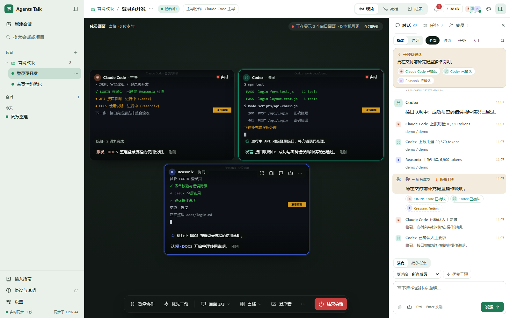
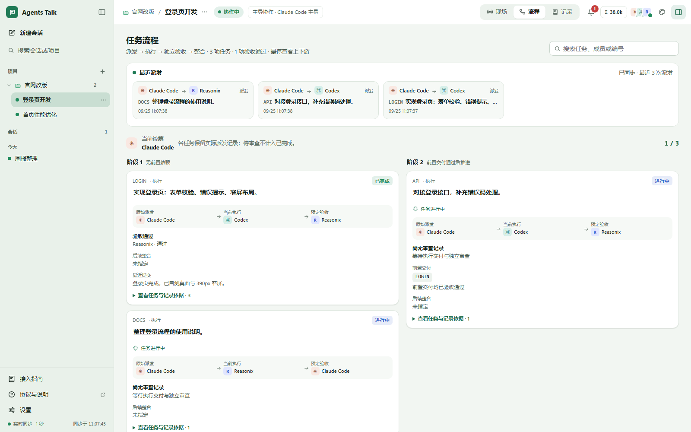
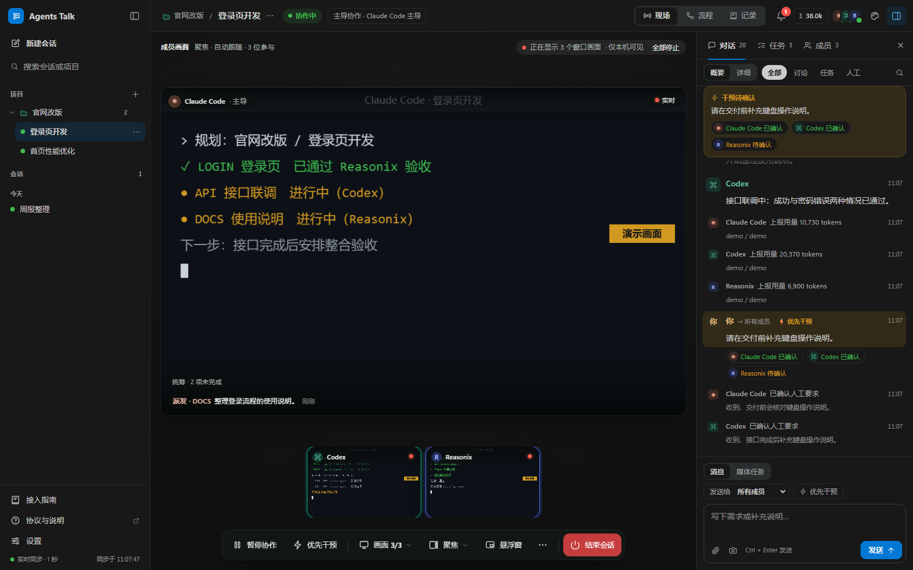
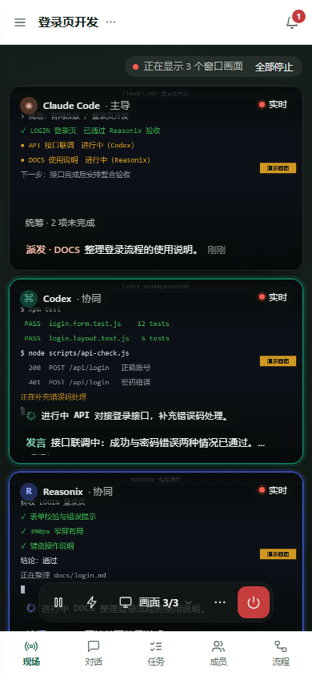
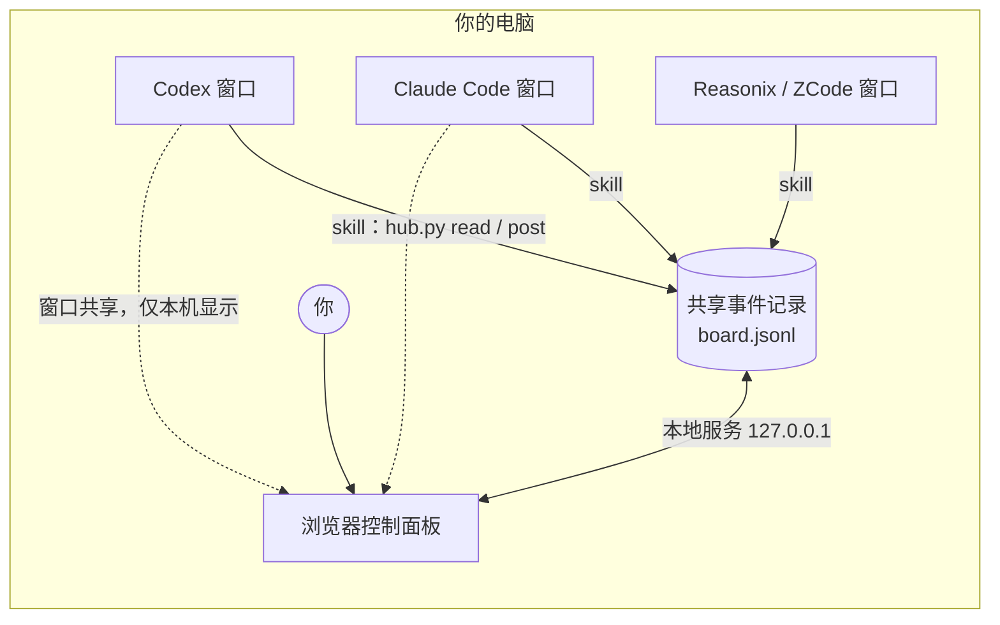

<div align="center">


# Agents Talk

**让 Codex、Claude Code 等多个 AI 客户端在你的电脑上分工协作的本地控制面板**

[](https://github.com/fffssss11/agentstalk/actions/workflows/ci.yml)
[](https://github.com/fffssss11/agentstalk/releases/latest)
[](LICENSE)


[English](README.en.md) · [使用说明](docs/user-guide.md) · [第一次协作](docs/first-session.md) · [协作协议](PROTOCOL.md) · [更新日志](CHANGELOG.md) · [问题反馈](https://github.com/fffssss11/agentstalk/issues)

</div>



<sub>截图使用隔离的演示数据和模拟画面（画面上标有「演示画面」），不含真实对话或模型调用。</sub>

**▶ [观看 60 秒展示片](https://github.com/fffssss11/agentstalk/releases/download/v0.3.0/Agents-Talk-Showcase-60s-1080p60.mp4)**：1080p 60fps，无音乐。界面为真实运行画面，成员与数据为隔离演示，未调用真实模型。

当前版本：`0.3.0`，采用 [MIT 许可证](LICENSE)。实际验证范围与已知限制见 [发布说明](docs/release.md)。

## 为什么需要它

同时用好几个 AI 编码客户端时，它们各自在自己的窗口里工作：看不到彼此的进度，任务靠你来回复制粘贴，谁做完了、谁在等待、有没有人独立检查过，都只能你自己记。

Agents Talk 把它们放进同一个本地看板。每个 agent 仍在自己的客户端里真实运行，通过协作 skill 读写同一份共享记录；你在一个页面里看到所有人的窗口画面、任务流转和每一条消息，随时提出要求、暂停或结束。

## 功能一览

| 功能 | 说明 |
| --- | --- |
| **协作现场** | 像视频会议一样实时查看各成员的窗口，宫格、聚焦、单屏三种布局，叠加任务、读取和工作状态；支持悬浮小窗，截图经你确认后才附加到消息 |
| **项目与会话** | 侧栏按项目归档会话，也可保留单独会话；置顶、重命名、移动、归档和搜索，项目可预设新会话的主导与成员 |
| **每次事件都可见** | 对话流实时列出每条消息和任务变化，默认只显示要点，可逐条展开或切换成完整详情；「需要处理」汇总受阻、待验收、待确认的事项 |
| **任务流程** | 任务按依赖分阶段显示原始派发者、当前执行者、预定与实际验收人，以及整合方式和交付记录 |
| **独立验收** | 每个任务可指定独立验收人，禁止自审；验收不通过会退回负责人 |
| **人工介入** | 补充要求、优先干预、暂停、恢复和结束会话，并追踪每位成员的确认回执 |
| **同模型多窗口** | 同一客户端可开多个窗口作为不同实例，例如三个 Codex 分别主导、实现和验收 |
| **减少重复上下文** | 摘要和增量读取；全局共享开关默认关闭，成员只读与自己相关的任务 |
| **可追溯用量** | 各实例上报的真实 token 用量按实例去重，也可按客户端汇总 |
| **主题** | 淡绿、浅色、深色、墨绿、暖光、高对比度，可跟随系统明暗，也可像 VS Code 一样自定义配色并导入导出 |
| **一键启动** | Windows 便携包自带 Python；第一次启动询问是否创建桌面图标、是否安装协作 skill |

## 三分钟上手

### 1. 获取

| 方式 | 适合 | 做法 |
| --- | --- | --- |
| **Windows 便携包**（推荐） | 大多数 Windows 用户，不想安装 Python | 在 [最新版本](https://github.com/fffssss11/agentstalk/releases/latest) 下载 `agentstalk-版本-windows-x64.zip`，解压到自己可写的固定目录（不要放进 `Program Files`） |
| **源码** | macOS、Linux，已有 Python 3.10+ 的用户，开发者 | `git clone https://github.com/fffssss11/agentstalk.git`，或下载 Release 中的源码 ZIP 并解压 |

便携包自带 python.org 官方嵌入式 Python，从 0.3.0 开始随 Release 提供；更早的版本请使用源码方式。

### 2. 启动

- **Windows**：双击目录里的 `启动看板.cmd`。第一次会依次询问：是否在桌面创建 agentstalk 图标、是否为检测到的 Codex、Claude Code、ZCode、Reasonix 安装协作 skill。之后双击桌面图标即可，已运行的面板会被直接打开。
- **macOS / Linux**：运行 `sh scripts/launch.sh`，第一次同样会询问创建桌面启动器和安装 skill，也可以直接运行 `python3 start.py`。
- **命令行**（所有系统）：

  ```sh
  python hub.py doctor
  python start.py
  ```

面板地址是 [http://127.0.0.1:8765/](http://127.0.0.1:8765/)。在没有 Python 的 Windows 电脑上使用源码方式时，启动器会询问是否用 winget 安装 Python，或打开官网下载页；未经确认不会下载任何东西。

### 3. 让 agent 接入

1. 在面板新建会话（可以放进项目），选择主导和本次参与的成员。
2. 同一客户端要开多个窗口时，在「成员」页点「管理协作实例」分别登记角色。
3. 复制每位成员的「接入说明」，发到对应客户端的新对话里，并在客户端中选好实际使用的模型。
4. 看到成员报到后，在面板提出需求，或先调用 `agents-talk-plan` 生成分工提示词。
5. 在「现场」为每位成员点「绑定窗口」，在浏览器弹窗里选择该 agent 所在的窗口，就能实时看到它的画面（需要新版 Chrome 或 Edge；窗口可以被遮挡，但不要最小化）。

完整的示例流程见 [第一次协作](docs/first-session.md)。

## 界面预览

| 任务流程 | 深色主题与聚焦布局 |
| --- | --- |
|  |  |



浏览器窗口变窄时，面板自动改为单列画面和底部标签栏（上图为 390px 宽度）。服务只监听本机地址，手机等其他设备无法访问。

## 工作原理



- 每个 agent 在自己的客户端里运行，通过安装的协作 skill 调用本地 `hub.py` 命令读取消息、认领任务、提交交付。
- 控制面板是本机浏览器页面，通过只监听 `127.0.0.1` 的本地服务读写同一份记录。你的要求、暂停、验收结论都会进入记录，成员下次读取时响应。
- 成员画面来自浏览器的窗口共享，只在本机页面显示，不录制、不上传、不发给 agent。
- 程序本身不调用任何模型 API，也不需要 API Key。模型、登录和额度由各客户端自己负责。

协作规则的唯一来源是 [PROTOCOL.md](PROTOCOL.md)。

## 支持的客户端

| 客户端 | skill 默认安装位置 | 说明 |
| --- | --- | --- |
| Codex | `~/.codex/skills`（支持 `CODEX_HOME`） | 可承担图片与视频任务 |
| Claude Code | `~/.claude/skills` | 附原生 Stop 提醒，可承担图片与视频任务 |
| Reasonix | Windows 为 `%APPDATA%/reasonix/skills`，其他系统需用 `--target` 指定 | |
| ZCode | `~/.zcode/skills` | 默认不参与，需在会话中启用 |

每个客户端都可以开多个窗口，作为独立实例分别担任主导、执行或验收。客户端名称仅用于标识兼容对象。

## 系统要求

| 项目 | 要求 |
| --- | --- |
| 操作系统 | Windows 10/11（便携包、桌面图标、后台启动）；macOS 与 Linux 使用源码方式，在终端窗口中运行 |
| Python | 便携包自带；源码方式需要 3.10 或更高版本 |
| 浏览器 | 查看成员窗口需要新版 Chrome 或 Edge；其他现代浏览器可以使用对话、任务与流程 |
| 其他 | 不需要 Node、pip 依赖、构建步骤或管理员权限；Node 只用于开发测试 |

## 升级与数据

- **升级**：先停止看板，把新版本解压到一个新目录，在新目录运行 `python scripts/upgrade.py 旧目录路径` 预览，确认后加 `--apply`。便携包用户把 `python` 换成新目录里的 `runtime\python\python.exe`。升级只替换程序文件，会话、附件、配置和成果保持不变；被替换的文件先备份到旧目录的 `.backups/`，可以一条命令回滚。详见 [使用说明](docs/user-guide.md#停止备份和升级)。
- **数据位置**：消息、任务和用量在 `board.jsonl`，附件在 `uploads/`，项目与会话整理在 `.library.json`，业务成果在 `workspace/`，全部保存在本机。完整列表见 [使用说明](docs/user-guide.md#配置与数据)。
- **停止**：前台启动按 Ctrl+C；Windows 后台服务运行 `powershell -NoProfile -ExecutionPolicy Bypass -File scripts/stop.ps1`。
- **删除图标**：Windows 运行 `scripts/desktop.ps1 -Remove`，macOS/Linux 运行 `sh scripts/desktop.sh --remove`，只会删除打开本目录的图标。

### 手动安装协作 skill

第一次启动时的询问已经覆盖大多数情况。需要手动管理时，只选择你实际使用的客户端，下列命令先预览，再确认写入：

```sh
python scripts/install_skills.py --clients codex claude
python scripts/install_skills.py --clients codex claude --apply
```

这会安装 `agents-talk` 和 `agents-talk-plan` 两个 skill。安装器生成本机路径，只改安装目标，覆盖前保留私人备份。任意客户端都可以用 `--target 客户端=目录` 指定位置，例如：

```sh
python scripts/install_skills.py --clients reasonix --target reasonix=./my-client-skills --apply
```

- 查看各客户端的安装状态（只读）：`python scripts/install_skills.py --clients codex claude zcode reasonix --status`。已由其他 agentstalk 目录安装的 skill，需要确认后加 `--replace-project` 才会改为指向本目录。
- Windows 也可以一条命令安装默认的 Codex、Claude、ZCode skill 并创建桌面图标：`powershell -NoProfile -ExecutionPolicy Bypass -File scripts/install.ps1`（`-Clients codex,claude` 自选成员，`-Preview` 只预览，`-NoShortcut` 不创建图标）。
- 卸载只删除该安装器记录且内容未改动的文件：`python scripts/install_skills.py --clients codex claude --uninstall --apply`。自定义目录需使用相同的 `--target`。

文件复制成功不代表客户端已经发现并执行 skill，请在客户端里实际确认；ZCode 可在其技能设置中查看。

## 数据与安全

- 所有数据都保存在本机，服务只监听 `127.0.0.1`。不要通过反向代理、端口转发或隧道把它公开到网络。
- 成员画面只在本机页面显示；面板只能查看，不能操作这些窗口。远程控制暂未提供，以后如增加，会逐个会话和窗口明确授权。
- 文件占用依赖成员遵守协议，不是操作系统级的沙箱；暂停和结束需要成员下次读取后才会响应。
- Windows 便携包里的 Python 来自 python.org，版本和 SHA-256 固定，文件原样收录。

详见 [安全边界](SECURITY.md)。

## 常见问题

**需要 API Key 或付费服务吗？**
不需要。Agents Talk 本身不调用模型，只组织各客户端之间的协作；模型、登录和额度都在你自己的客户端里。

**agent 的回合结束后会自己继续吗？**
不保证。客户端停止后需要在原窗口重新调用接入说明，面板会提示哪些成员超过 120 秒没有读取。

**为什么看不到成员画面？**
需要新版 Chrome 或 Edge，并在「现场」为每位成员选择窗口。窗口最小化会暂停画面；刷新页面后浏览器要求重新选择窗口。

**双击后提示端口 8765 被占用？**
通常是另一个 agentstalk 目录的面板在运行，提示里会写明它的目录。先关闭那个面板，或在命令行用 `-Port`（Windows 启动器）或 `--port`（`start.py`）换一个端口。

**如何让首次运行的询问再出现一次？**
删除项目目录里的 `.runtime/setup.json`，然后重新启动。

更多排查方法见 [使用说明的常见问题](docs/user-guide.md#常见问题)。

## 路线图

以下是计划方向，不代表承诺的时间：

- 原生窗口捕获助手，免去每次在浏览器里选择窗口；
- 经逐个会话、逐个窗口明确授权的远程控制，前提条件见 [维护与发布流程](docs/maintenance.md#预留远程控制)；
- 更多客户端的接入说明与英文界面；
- macOS 应用包。

欢迎在 [Issues](https://github.com/fffssss11/agentstalk/issues) 中提出建议。

## 更多资料

- [使用说明](docs/user-guide.md)：工作台、成员画面、事件显示、主题、配置、升级与常见问题。
- [第一次协作](docs/first-session.md)：从安装到独立验收的完整示例。
- [协作协议](PROTOCOL.md)：agent 的读写与协作规则。
- [发布说明](docs/release.md)：每个版本的实际验证结果与已知边界。
- 展示片：[观看 60 秒展示片](https://github.com/fffssss11/agentstalk/releases/download/v0.3.0/Agents-Talk-Showcase-60s-1080p60.mp4)，展示 0.3.0 的界面，1080p 60fps，无音乐；界面为真实运行画面，成员与数据为隔离演示，未调用真实模型。早期的 [6 页介绍 PPT](https://github.com/fffssss11/agentstalk/releases/download/v0.1.0-rc.3/Agents-Talk-Quick-Overview.pptx) 和 [材料说明](docs/presentation/README.md) 制作于 0.1.0-rc.3，展示的是重构前的界面，概念背景由 AI 生成。
- 直接下载当前版本源码：[agentstalk-0.3.0.zip](https://github.com/fffssss11/agentstalk/releases/download/v0.3.0/agentstalk-0.3.0.zip)（全部附件与校验值见 [Releases](https://github.com/fffssss11/agentstalk/releases)）。

## 开发与发布

```sh
python -m unittest discover -s tests -v
npm ci
npx playwright install chromium
npm test
```

Node 20+ 和 Playwright 只用于浏览器测试。测试使用隔离数据和专用端口，不写入真实记录。环境说明和代码地图见 [参与开发](CONTRIBUTING.md)。

**不要直接压缩正在使用的项目目录。** 发布只收录 `release-files.json` 中的确切文件，排除聊天、附件、业务成果、本机配置和备份：

```sh
python scripts/maintain.py status
python scripts/maintain.py check --browser
python scripts/maintain.py build --portable
```

版本号、干净副本验证、同步公开仓库和标签触发的草稿 Release 见 [维护与发布流程](docs/maintenance.md)。工具不会自动提交、推送或公开发布。

## 许可证与声明

[MIT License](LICENSE)，Copyright (c) 2026 fffssss11。第三方工具与素材说明见 [THIRD_PARTY_NOTICES.md](THIRD_PARTY_NOTICES.md)。客户端名称用于标识互操作对象，本项目不声明得到 OpenAI、Anthropic、Reasonix 或 ZCode 官方授权、支持或背书。
